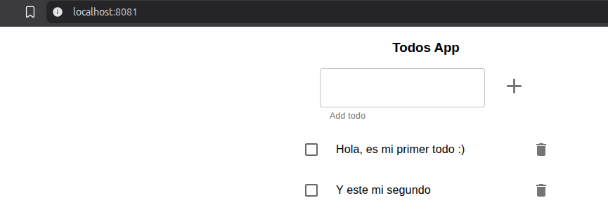
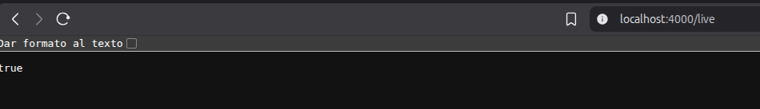
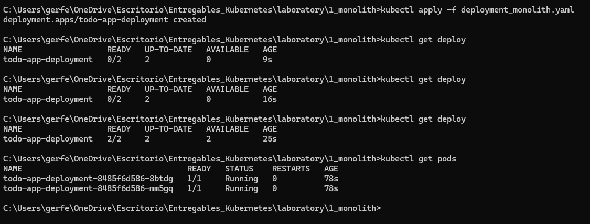
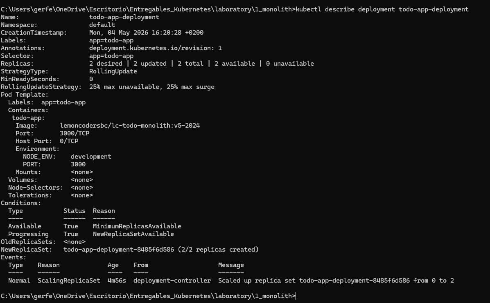
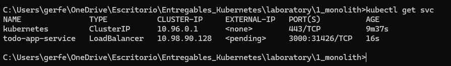
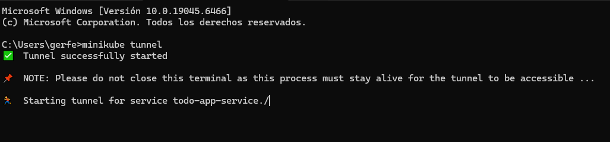
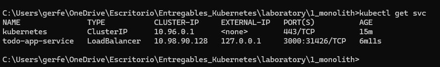
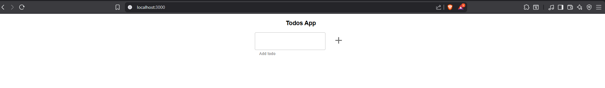

# Monolito en memoria

## Probamos la aplicación en local y utilizando contenedores

- Nos copiamos la carpeta que contiene el frontal y el back en nuestro directorio.

Se ha añadido la carpeta que incluye ambos proyectos `todo-app` a este directorio `1_monolith`.

- Instalamos las dependencias del front y del back.
```bash
# Instalación dependencias del front
cd ./todo-app/frontend
npm install

# Instalación dependencias del back
cd ./todo-app
npm i
```

**Nota:** Añadimos a nivel de raiz de la carpeta `laboratory` un `.gitignore` para ir descartando subir las dependencias instaladas y las variables de entorno.

- Le echamos un ojo por encima a los 2 proyectos y establecemos las variables de entorno en este caso: `NODE_ENV` Y `PORT`.
```bash
# Rellenamos las variables de entorno en un archivo nuevo .env en la raiz de 'todo-app'
NODE_ENV=development
PORT=4000
```

- Arrancamos localmente los proyectos.
```bash
## El back (utiliza Nodemon)
cd ./todo-app
npm start

## El front
cd ./todo-app/frontend
npm run start:dev:server # Esto ya realmente te esta levantado el front (puerto webpack 8081) y el back (puerto 4000)
```
Tenemos funcionando localmente el front:


Y también la API del back:


- Construimos la imagen de Docker a partir del Dockerfile de la raiz.
```bash
cd ./todo-app
docker build -t ger/awesome-monolith . 
```

- Corremos la imagen construida y comprobamos que hemos podido levantar el proyecto partiendo de la imagen en local.
```bash
docker run -d -p 4000:4000 \
  -e NODE_ENV=development \
  -e PORT=4000 \
  ger/awesome-monolith
```

Ya tenemos corriendo nuestro contenedor con el monolíto.

## Despliegue en Kubernetes

**Paso 1. Crear todo-app**
Crear un Deployment para todo-app, usar el Dockerfile de este direetorio todo-app, para generar la imagen necesaria.

Nota: Se puede usar la imagen lemoncodersbc/lc-todo-monolith:v5-2024

Al ejecutar un contenedor a partir de la imagen anaterior, el puerto por defecto es el 3000, pero se lo podemos alimentar a partir de variables de entorono, las variables de entorno serían las siguientes

NODE_ENV : El entorno en que se está ejecutando el contenedor, nos vale cualquier valor que no sea test
PORT : El puerto por el que va a escuchar el contenedor.

Comando ejecutado desde esta ubicación:
```bash
kubectl apply -f deployment_monolith.yaml
```

Comprobamos que esta todo desplegado:




**Paso 2. Acceder a todo-app desde fuera del clúster**
Crear un LoadBalancer service para acceder al Deployment anteriormente creado desde fuera del clúster. Para poder utilizar un LoadBalancer con minikube seguir las instrucciones de este artículo

Comando ejecutado desde esta ubicación:
```bash
kubectl apply -f service_monolith.yaml
```

Comprobamos que el servicio esta desplegado:



Y en otra terminal aparte para abrir el tunnel de Minikube:
```bash
minikube tunnel
```

He abierto ya el tunel:



Ahora la external-ip del servicio ya no está en "pending" y pasa a tener una ip:



Desde mi navegador ya tengo acceso a la app:


