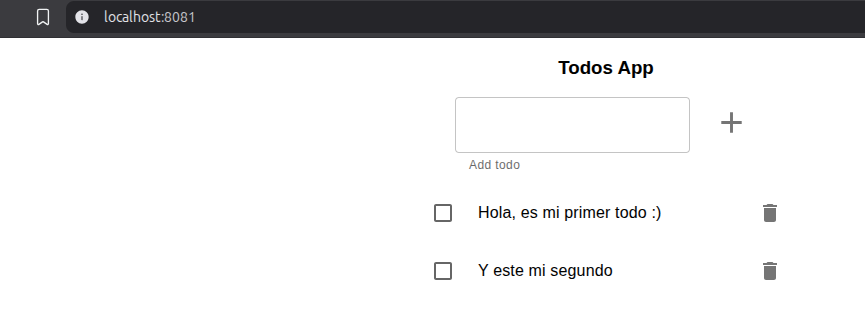
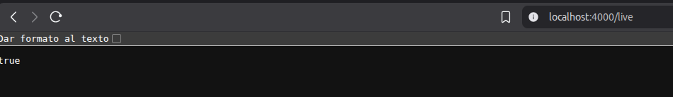

# Monolito en memoria

## Probamos la aplicación en local y utilizando contenedores

- Nos copiamos la carpeta que contiene el frontal y el back en nuestro directorio.

Se ha añadido la carpeta que incluye ambos proyectos `todo-app` a este directorio `1_monolith`.

- Instalamos las dependencias del front y del back.
```bash
# Instalación dependencias del front
cd ./todo-app/frontend
npm install

# Instalación dependencias del back
cd ./todo-app
npm i
```

**Nota:** Añadimos a nivel de raiz de la carpeta `laboratory` un `.gitignore` para ir descartando subir las dependencias instaladas y las variables de entorno.

- Le echamos un ojo por encima a los 2 proyectos y establecemos las variables de entorno en este caso: `NODE_ENV` Y `PORT`.
```bash
# Rellenamos las variables de entorno en un archivo nuevo .env en la raiz de 'todo-app'
NODE_ENV=development
PORT=4000
```

- Arrancamos localmente los proyectos.
```bash
## El back (utiliza Nodemon)
cd ./todo-app
npm start

## El front
cd ./todo-app/frontend
npm run start:dev:server # Esto ya realmente te esta levantado el front (puerto webpack 8081) y el back (puerto 4000)
```
Tenemos funcionando localmente el front:


Y también la API del back:


- Construimos la imagen de Docker a partir del Dockerfile de la raiz.
```bash
cd ./todo-app
docker build -t ger/awesome-monolith . 
```

- Corremos la imagen construida y comprobamos que hemos podido levantar el proyecto partiendo de la imagen en local.
```bash
docker run -d -p 4000:4000 \
  -e NODE_ENV=production \
  -e PORT=4000 \
  ger/awesome-monolith
```
**Nota:** Ya tenemos corriendo nuestro contenedor con el monolíto, algunas consideraciones, podemos ejecutarlo todo desde el mismo puerto esta vez porque la generación de la imagen crea el 'build' del front y luego el back se encarga de servir archivos estáticos desde public. Una última consideración el back no tiene un logger así que no puedes ver logs pero si puedes ver las llamadas desde el 'network' del navegador.

## Despliegue en Kubernetes

### Subir la imagen de Docker que vamos a utilizar a un registro público o cargarla en Minikube.
### Crear el deployment y comprobar que esta funcionando correctamente.
### Crear un servicio LoadBalancer para acceder a la app desde fuera del cluster. 

## Preguntas y reflexiones relacionadas

1. ¿Se puede crear el deployment utilizando una imagen que tengas localmente en tu máquina?
2. ¿Aparte del servicio LoadBalancer es necesario un servicio interno adicional que abarque tu deployment?