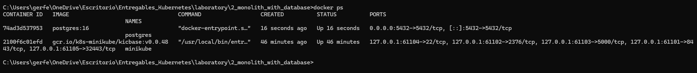
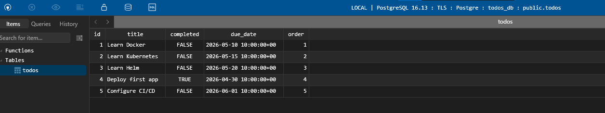
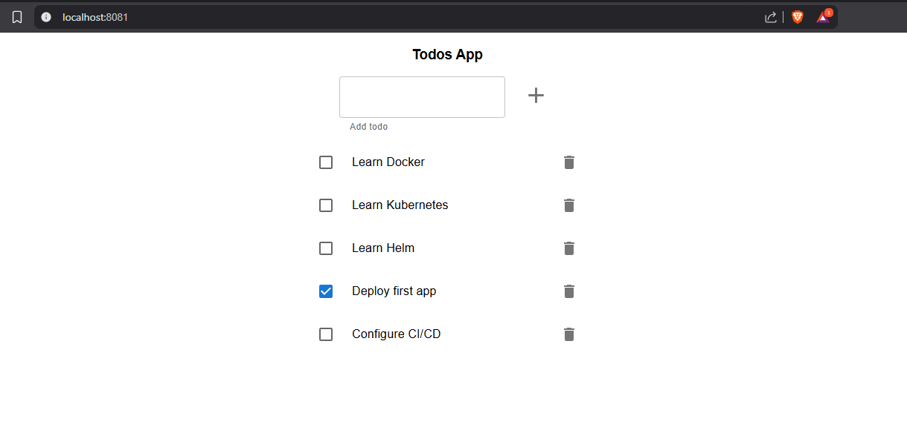
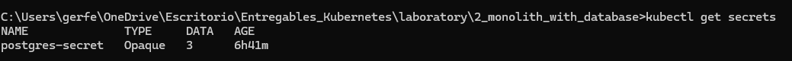
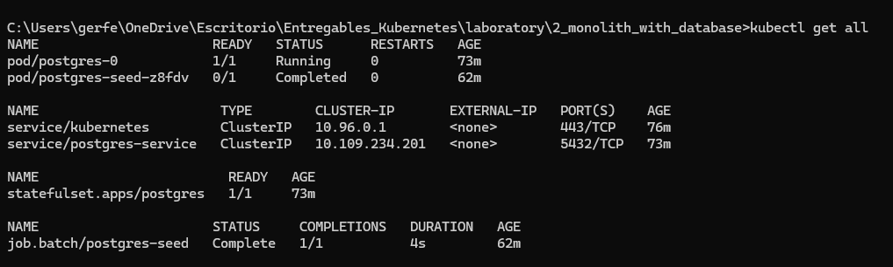
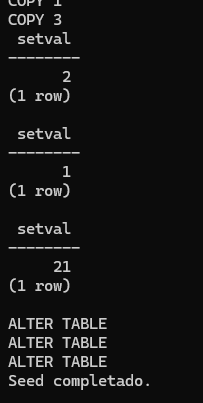
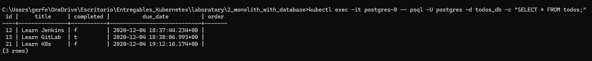
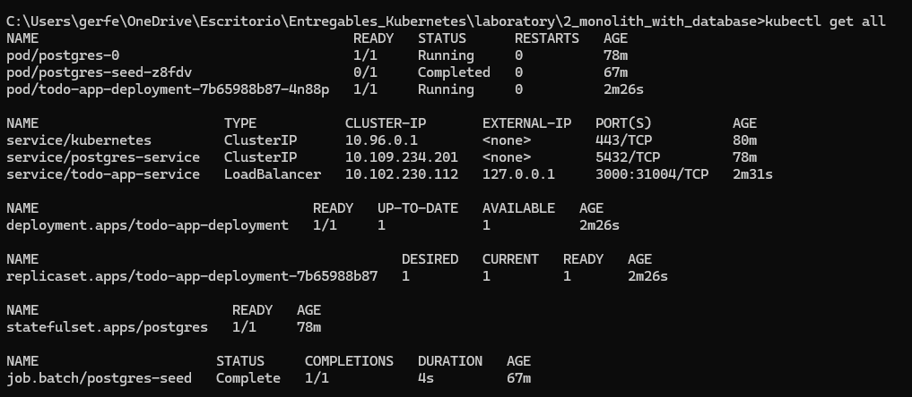
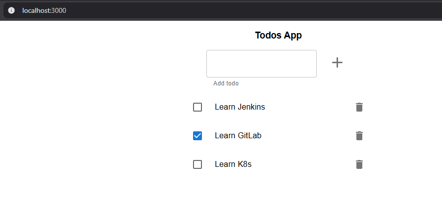
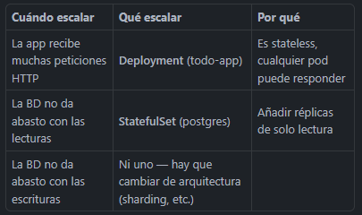

# Monolito con base de datos.

## Ejecutar la solución localmente
Para iniciar una base de datos lista para trabajar localmente, ejecutamos el siguiente comando (le he añadido la variable de entorno porque sino no levanta el contenedor):

```bash
docker run --rm -d -p 5432:5432 -e POSTGRES_PASSWORD=postgres --name postgres postgres:16
```



Una vez que el contenedor esté en ejecución, podemos poblar los datos con:

```bash
docker exec -it postgres psql -U postgres
```

Pega el código de todo-app/todos_db.sql y la base de datos se iniciará con algunos datos.



Variables de entorno
Crea todo-app/.env con la configuración de base de datos anterior, los valores deben ser

```bash
NODE_ENV=develop
PORT=3000
DB_HOST=localhost
DB_USER=postgres
DB_PASSWORD=postgres
DB_PORT=5432
DB_NAME=todos
DB_VERSION=16
```

**Ejecutar la aplicación**

Primero necesitamos instalar las dependencias, cambia el directorio a todo-app/frontend y ejecuta npm install, luego cambia el directorio a /todo-app y ejecuta npm install. Una vez instaladas todas las dependencias, podemos ejecutar la solución localmente cambiando el directorio a todo-app/frontend y ejecutando npm run start:dev:server.

### 1. Instalar dependencias del frontend

```bash
cd ./todo-app/frontend
npm install
```

### 2. Instalar dependencias del backend

```bash
cd ../
npm install
```

### 3. Para iniciar la solución, ejecuta el siguiente comando desde el front

```bash
npm run start:dev:server
```

Ya tenemos la aplicación levantado recuperando los datos de base de datos:



## Infraestructura con Kubernetes

Hacemos un poco de limpieza del cluster antes de empezar:

```bash
# Borramos deployment, servicios, replicaset y pods
kubectl delete all --all

# Comprobamos que es lo que tenemos en el cluster antes de continuar
kubectl get all
```

Seguir los siguientes pasos:

### Paso 1. Crear una capa de persistencia de datos

Crear un `StatefulSet` para tener una base de datos dentro del cluster, para ello generar los siguientes recursos:

Crear un `ConfigMap` con la configuración necesaria de base de datos, en este apartado ya que vamos a crear este tipo de objetos también para el deployment y el job hemos optado por probar una estrategia diferente utilizando `Secrets` (bueno y también porque creo que datos sensibles como la contraseña de base de datos deberían colocarle en este tipo de objetos)

```bash
kubectl create secret generic postgres-secret \
  --from-literal=db-user=postgres \
  --from-literal=db-password=postgres \
  --from-literal=db-name=todos_db
```



Crear un `StorageClass` para el aprovisionamineto dinámico de los recursos de persistencia
Crear un `PersistentVolume` que referencie el StorageClass anterior
Crear un `PersistentVolumeClaim` que referencie el StorageClass anterior
Crear un `Cluster IP service`, de esta manera los pods del Deployment anterior serán capaces de llegar al StatefulSet
Crear el `StatefulSet` alimentando las variables de entorno y el volumen haciendo referencia al PersistentVolumeClaim creado anteriormente.

Hemos creado los yaml con todo lo indicado, los 3 primeros son los relacionados al almacenamiento, el servicio y el statefulset y **los 2 últimos relacionados a la creación de un job encargado de ejecutar seed en base de datos** (está solución la hemos tomado siguiendo como referencia una de las propuestas en el apartado comentarios) 

```bash
kubectl apply -f postgres-storage.yaml
kubectl apply -f postgres-service.yaml
kubectl apply -f postgres-statefulset.yaml
kubectl apply -f seed-configmap.yaml
kubectl apply -f seed-job.yaml
```

Comprobamos que todo se ha levantado correctamente:



Comprobamos que el job ha hecho su trabajo:

```bash
kubectl logs job/postgres-seed
```



Y vemos que la base de datos efectivamente tiene datos:

```bash
kubectl exec -it postgres-0 -- psql -U postgres -d todos_db -c "SELECT * FROM todos;"
```



### Paso 2. Crear todo-app

Crear un Deployment para todo-app, usar el Dockerfile de este direetorio todo-app, para generar la imagen necesaria.

Nota: Podéis usar la imagen lemoncodersbc/lc-todo-monolith-db:v5-2024

Al ejecutar un contenedor a partir de la imagen anterior, el puerto por defecto es el 3000, pero se lo podemos alimentar a partir de variables de entorono, las variables de entorno serían las siguientes

NODE_ENV : El entorno en que se está ejecutando el contenedor, nos vale cualquier valor que no sea test
PORT : El puerto por el que va a escuchar el contenedor
DB_HOST : El host donde se encuentra la base de datos
DB_USER: El usuario que accede a la base de datos, podemos usar el de por defecto postgres
DB_PASSWORD: El password para acceeder a la base de datos, podemos usar el de por defecto postgres
DB_PORT : El puerto en el que postgres escucha 5432
DB_NAME : El nombre de la base de datos, en todo-app/todos_db.sql, el script de inicialización recibe el nombre de todos_db
DB_VERSION : La versión de postgres a usar, en este caso 10.4
Crear un ConfigMap con todas las variables de entorno, que necesitarán los pods de este Deployment.

NOTA: Las obligatorias son las de la base de datos, todas aquellas que comienzan por DB

```bash
kubectl apply -f todo-app-configmap.yaml
kubectl apply -f todo-app-service.yaml
kubectl apply -f todo-app-deployment.yaml
```

Comprobamos que todo se ha levantado correctamente:



### Paso 3. Acceder a todo-app desde fuera del clúster

Crear un LoadBalancer service para acceder al Deployment anteriormente creado desde fuera del clúster. Para poder utilizar un LoadBalancer con minikube seguir las instrucciones de este artículo.

Levantamos Minikube tunnel y comprobamos si ahora tenemos accesible el aplicativo desde el navegador (en este apartado no voy a poner todos los pasos ya que son exactamente iguales que el anterior)



### Comentarios

Hacer un seed de datos de una BBDD es una tarea muchas veces necesarias. Usar una imagen "cocinada" no es, ni de lejos, la mejor de las opciones ya que implica generar la imagen cada vez que el sql del seed se modifica lo que no es muy correcto.

En su lugar, hay varias alternativas que podríamos usar:

1. En lugar de usar una imagen "cocinada" que es idéntica a la original pero con un fichero añadido podríamos pasar este fichero a través de un volumen (poner el fichero en un ConfigMap y montar el ConfigMap en el contenedor).

2. Usar un job de Kubernetes que ejecutase el script. Este job podría ejecutar un contenedor que usase el cliente de la bbdd (psql en nuestro caso) y que lanzase el script contra la bbdd. El script se lo pasaríamos mediante un volumen usando un ConfigMap.

3. Usar un init container en el cliente (no en la base de datos). No podemos usar un init container en el pod de la bbdd porque cuando se ejecutaría este init container no se estaría ejecutando la bbdd. No obstante usar un init container en el cliente (el pod de la app) no es una buena idea por dos motivos: el primero es que si el cliente se levanta antes que la bbdd, el init container no se podrá ejecutar, dará error y el pod quedará en Init:Error. El segundo es que este init container se ejecutaría cada vez que se crease el pod de la app (si se escala horizontalmente cada pod tendrá su propio init container), por lo que el script debe estar preparado para poder ser ejecutado N veces en paralelo y ser idempotente (lo que añade una complejidad inecesaria).

### Inquietudes
1. **¿Los seeders solo afectan a una estancia de base de datos en el caso que tuvieramos más réplicas?**

Sí, solo afectan a una instancia, pero hay que entender cómo funciona Postgres con réplicas:

Postgres no es como una app stateless. No puedes simplemente poner replicas: 3 en el StatefulSet y que funcione. Las réplicas de Postgres funcionan en modo primario/secundario (primary/replica):

El primario acepta escrituras y lecturas.
Los secundarios son copias de solo lectura que se sincronizan con el primario via replicación de WAL (Write-Ahead Log).

Por tanto el seed solo se ejecuta contra el primario, y los datos se propagan automáticamente a las réplicas por replicación. No hay que lanzar el seed N veces — hacerlo sería un error y corrompería datos.

2. **¿Un StatefulSet siempre funciona como primario/réplica?**

No. El StatefulSet es simplemente un mecanismo de Kubernetes para gestionar pods con identidad estable (nombres predecibles, almacenamiento propio). Lo que haga con esa identidad depende de la aplicación.

El StatefulSet no impone ningún modelo — solo garantiza que postgres-0 siempre se llama igual y siempre tiene el mismo volumen. La lógica de quién es primario/réplica/árbitro la gestiona la propia aplicación o un operador externo.

3. **¿En el caso de escalar el aplicativo que habría que hacer? ¿Qué escalar: Deployment o StatefulSet?**

Depende de qué parte necesita más capacidad:



En el 90% de los casos en producción escalas el Deployment. La BD suele ser el cuello de botella menos frecuente y más complejo de resolver.