# Aplicación Distribuida.

### Ejecutar soluciones localmente
Abre dos terminales,en una de ellas cambia al directorio todo-api y ejecuta npm start, en la otra terminal cambia al directorio todo-front y ejecuta npm start (instala dependencias en los dos proyectos)

Tenemos la aplicación corriendo:

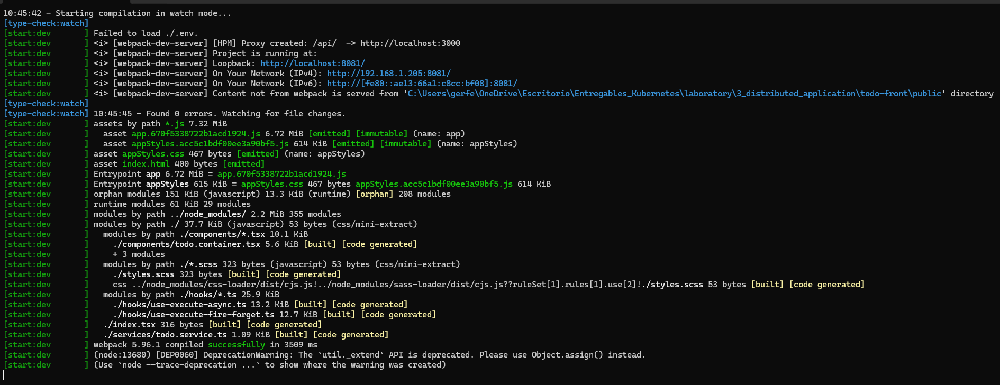

Tenemos acceso desde el puerto 8081:

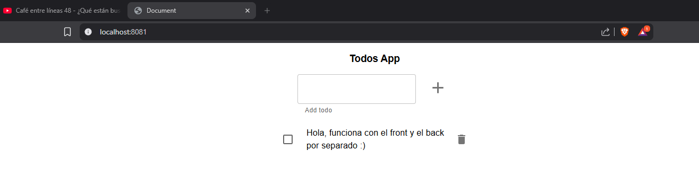

### Ejecutar soluciones localmente usando Docker

Iniciar el backend:

```bash
docker run -d -p 3000:3000 \
  -e NODE_ENV=development \
  -e PORT=3000 \
  --name todo-api \
  lemoncodersbc/lc-todo-api:v5-2024
```

Iniciar el frontend, para conectar el frontend y el backend, debes construir la imagen de la siguiente manera:

```bash
docker build -t lemoncodersbc/lc-todo-front:v5-2024 --build-arg  API_HOST=http://localhost:3000 .
docker run -d -p 80:80 --name todo-front lemoncodersbc/lc-todo-front:v5-2024
```

He utilizado las imágenes que luego utilizaré en el cluster porque no existian las puestas en el registro de Docker.

Todo levantado correctamente y como puerto de entrada el 80:

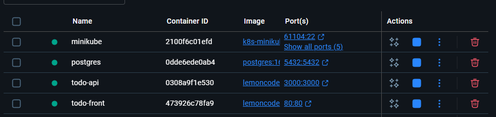

## Infraestructura con Kubernetes

Hacemos un poco de limpieza del cluster antes de empezar:

```bash
# Borramos deployment, statefulset, servicios, replicaset, jobs y pods
kubectl delete all --all

# Comprobamos que es lo que tenemos en el cluster antes de continuar
kubectl get all
```

Limpiamos también storageClass, pv, pvc, configmaps y secrets:

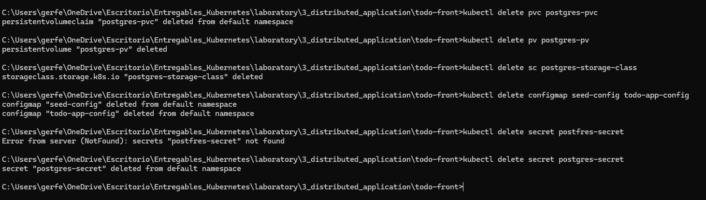

```bash
# Comprobamos el estado de todo lo que hemos borrado para ver que no la hemos liado
kubectl get sc,pv,pvc,configmaps,secrets -A
```

### Paso 1. Crear todo-front.
Crear un Deployment para todo-front, usar el Dockerfile de este directorio 02-distributed/todo-front, para generar la imagen necesaria. Notar que existe ARG API_HOST dentro del fichero Dockerfile, lo podemos omitir en este caso, sólo está ahí para poder probar el contenedor de Docker en local.

Nota: Podéis usar la imagen lemoncodersbc/lc-todo-front:v5-2024

Al ejecutar un contenedor a partir de la imagen anterior, el puerto expuesto para http es el 80.

Crear un Cluster IP Service que exponga todo-front dentro del clúster.

Desplegamos el servicio y el deployment:

```bash
kubectl apply -f todo-front-service.yaml
kubectl apply -f todo-front-deployment.yaml
```

### Paso 2. Crear todo-api.
Crear un Deployment para todo-api, usar el Dockerfile de este directorio 02-distributed/todo-api, para generar la imagen necesaria.

Nota: Puedes usar la imagen lemoncodersbc/lc-todo-api:v5-2024

Al ejecutar un contenedor a partir de la imagen anterior, el puerto por defecto es el 3000, pero se lo podemos alimentar a partir de variables de entorono, las variables de entorno serían las siguientes

NODE_ENV : El entorno en que se está ejecutando el contenedor, nos vale cualquier valor que no sea test
PORT : El puerto por el que va a escuchar el contenedor
(Opcional) Crear un ConfigMap que exponga las variables de entorno anteriores.

Crear un Cluster IP Service que exponga todo-api dentro del clúster.

Desplegamos el configmap, servicio y el deployment:

```bash
kubectl apply -f todo-api-configmap.yaml
kubectl apply -f todo-api-service.yaml
kubectl apply -f todo-api-deployment.yaml
```

### Paso 3. Crear un Ingress para acceder a los servicios del clúster
Crear un Ingress para exponer los servicios anteriormente creados. Como referencia para crear este controlardor con minikube tomar como referencia el siguiente ejemplo Set up Ingress on Minikube with the NGINX Ingress Controller

Antes de desplegarlo vemos una foto de lo que tenemos desplegado:

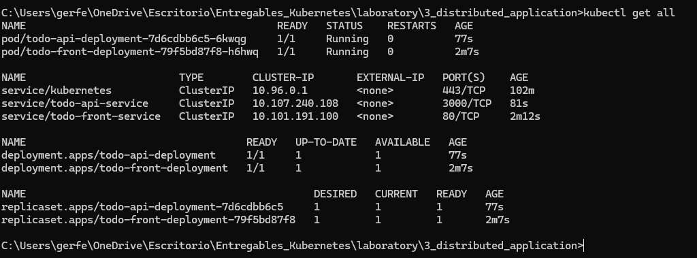

Necesitamos un Ingress Controller para funcionar. En Minikube se instala con:

```bash
minikube addons enable ingress
```

Verificamos el addon agregado y verificamos que el pod del controlador esté corriendo:

```bash
minikube addons list
kubectl get pods -n ingress-nginx
```

Addon:

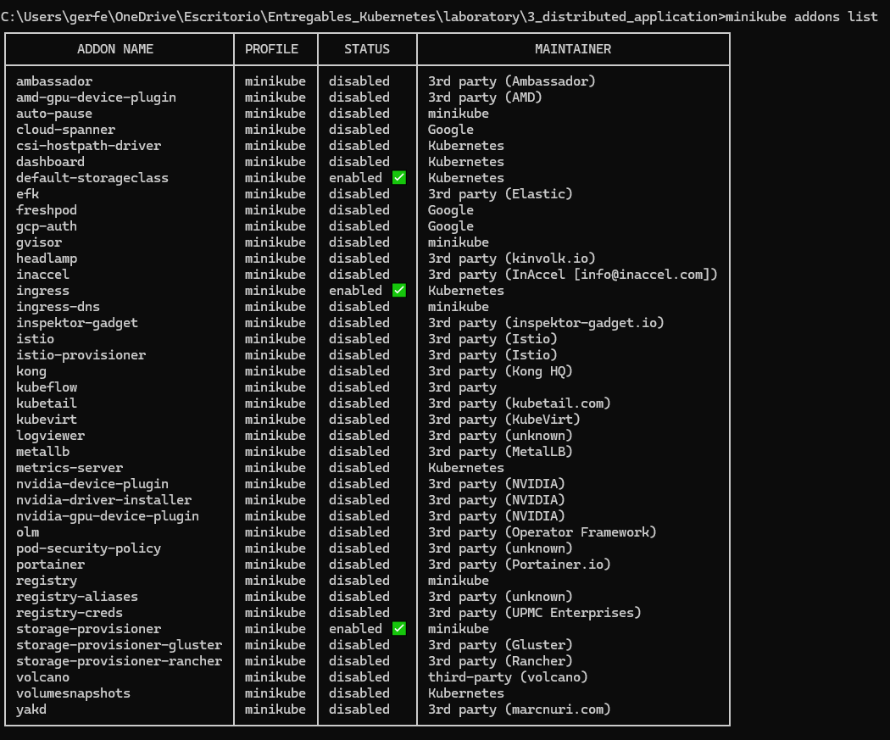

Pod:

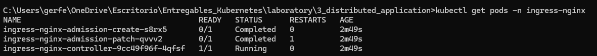

Desplegamos el ingress:

```bash
kubectl apply -f ingress.yaml
```

Verificamos que se haya creado y que tenga una dirección asignada:

```bash
kubectl get ingress
```

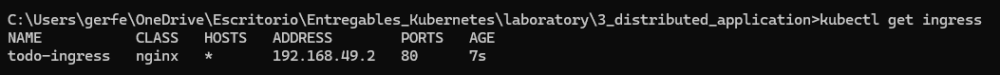

Creamos con Minikube un tunel temporal:

```bash
minikube service -n ingress-nginx ingress-nginx-controller
```

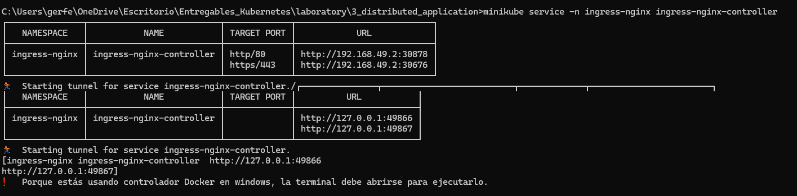

Confirmamos desde el navegador que todo funciona correctamente:

El front:

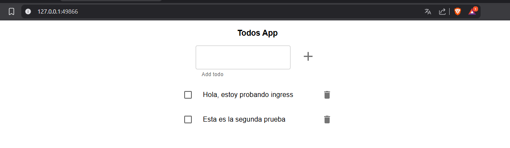

El back:

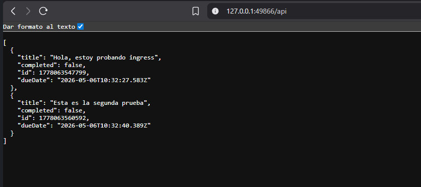

Resumén de las conexiones:

Mi navegador → http://127.0.0.1:49866/ → túnel de minikube → VM Minikube :30878 → NodePort → ingress-nginx-controller:80 → reglas del Ingress:
  - /api/* → todo-api-service:3000
  - /*     → todo-front-service:80